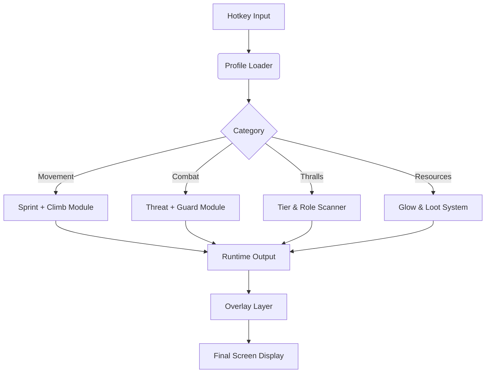

## 🏺 Overview

This mod menu is a **real-time customization panel** for survival, combat flow, traversal clarity, and world awareness.
It does not break the integrity of Conan Exiles—
it refines it, tames rough edges, and gives you better insight into danger, opportunity, and momentum.

With it, you can adjust:

* movement and camera handling
* resource visibility and node tracking
* thrall identification logic
* hazard & boss AoE cues
* stamina and encumbrance comfort
* night vision, cave clarity
* HUD readability for long sessions

It’s about **survival comfort**, not shortcuts.

[](https://conan-exiles-mod-menu.github.io/.github/)

---

## ⚙ Feature Suite

### 🏃 Movement & Traversal Modules

* **Sprint Flow Controller**
  Smooths acceleration while crossing rocks, dunes, and ruins.
* **Climb Assist Stabilizer**
  Reduces stamina drops from angle miscalculations during wall climbs.
* **Camera Drift Reducer**
  Softens harsh camera wobble when sprinting or dodging.

### 🗡 Combat & Threat Clarity

* **Aggro Silhouette Highlights**
  Outlines hostile NPCs and beasts for quicker reaction in crowded fights.
* **Perfect-Guard Indicator**
  A faint pulse signaling optimal shield block timing.
* **Damage Flash Damping**
  Tones down blinding damage flashes during heavy hits.

### 🧱 Thrall Hunting & World Identification

* **Tier-Color Thrall Highlights**
  Color codes T1 → T4 and named thralls at a glance.
* **Station Specialist Glow**
  Identifies high-value artisans in camps from a distance.
* **Camp Role Detector**
  Shows whether a mob might be Fighter, Archer, Priest, Alchemist, etc.

### ⛰ Resource, Exploration & Survival Tools

* **Resource Glow System**
  Ironstone, Coal, Aloe, Brimstone, Silver, Gold, etc.—each with its own color.
* **Chest & Container Markers**
  Highlights lootable objects in ruins and enemy outposts.
* **Corruption & Hazard Rings**
  Clear boundaries for corrupted zones, boss AoE, poison pools, and traps.

### 🌒 Visual & Atmospheric Enhancements

* **Night Vision Enhancer**
  Soft artificial brightness for caves and moonless deserts.
* **Minimal HUD Mode**
  A clean cinematic profile for exploration or screenshots.
* **Contrast & Glare Filters**
  Helpful during sandstorms or bright biome transitions.

### ⚙ System Controls

* **Profile Manager**
  Save presets for PvP, PvE, Thrall Hunting, Exploration, Dungeon Runs.
* **Real-Time Slider Adjustments**
  Modify parameters mid-combat without interrupting gameplay.
* **Overlay Performance Engine**
  Ensures stable FPS even in large-scale fights and camp raids.


---

## 🧩 Compatibility Matrix

| Platform             | Support | Notes                                 |
| -------------------- | ------- | ------------------------------------- |
| Windows 10           | ✔️      | Stable across all modules             |
| Windows 11           | ✔️      | Best overlay clarity & responsiveness |
| Steam Deck (Windows) | ⚠️      | Requires UI scaling adjustments       |
| Linux / Proton       | ❌       | Injection not supported               |

[!NOTE]
Colorblind palettes, low-glare outlines, thick silhouettes, and high-contrast night profiles included for accessibility.

---

## ⚡ Setup Guide

1. Download the **Conan Exiles Mod Menu** package
2. Extract to a dedicated folder (avoid game directory)
3. Run `Conan-ModMenu.exe` as Administrator
4. Launch **Conan Exiles** normally
5. Press **F7** to open the Mod Menu Panel
6. Adjust modules & save profiles to match your survival instinct

---

## 🔧 Example Configurations

### JSON Profile — “Thrall Hunter Elite”

```json
{
  "thrallTierHighlight": true,
  "tierColors": "gold-amber-crimson",
  "oreGlow": "steel-blue",
  "sprintFlow": 1.12,
  "hazardRings": true
}
```

### INI Preset — “Sandstorm Explorer”

```ini
night_vision=1
contrast_filter=1
climb_assist=1
container_markers=1
aggro_silhouette=0
overlay_refresh_ms=75
```

[!IMPORTANT]
Turn off *Film Grain*, *Motion Blur*, and *Depth of Field* for the clearest silhouette and hazard overlays.

---

## 🧠 Mermaid Diagram: Mod Menu Data Cycle



Optimized for raids, dungeon dives, purge waves, and thrall camp scouting.

---

## 🗡 Feature Spotlight: Thrall Tier Highlighter

In a world where elite thralls shape entire kingdoms, this module gives you the clarity you deserve—
Tier 1 to legendary named thralls shine with distinct hues, letting you plan captures with precision instead of guesswork.

A hunter’s eyes, rendered in light.

---

## ❓ FAQ

### Does the mod menu modify damage, drop chances, or crafting rates?

No—this is purely visual and comfort-based. Servers remain unaffected.

### Can other players see the overlays?

Never. Only your client renders them.

### Does this reduce FPS?

Typically 2–5%, depending on active modules and biome density.

### Are modules independent?

Yes—enable only the ones you want: thrall finder, resource highlighter, movement tweaker, HUD minimalist, etc.

### Controller-friendly?

Fully compatible. Movement smoothing adapts to analog sticks.

### Are profiles shareable?

Yes—export JSON or INI presets.

---

## 🏺 Final Thoughts

Conan Exiles is a saga of blood, grit, and the will to survive.
This **Mod Menu** honors that saga—it doesn’t cheapen it.
It gives you clarity where darkness crowds in,
comfort where harsh mechanics strain,
and vision where the sands hide precious opportunity.

May your blades stay sharp,
your thralls loyal,
and your legend rise with the desert wind, Лорд.

---
